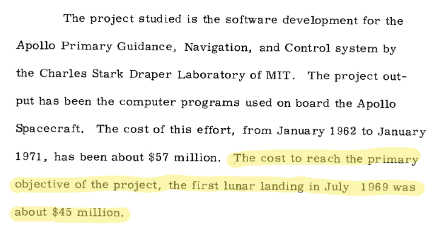

---


---

# Nate Berkopec

^ Good morning everyone! I'm Nate Berkopec, and today we're going to talk about how to guide, navigate and control a rocket into orbit around Earth, and we're going to do it with Ruby. Although not known for aerospace applications, Ruby can definitely get the job done.

---


^ I'm a freelancer and consultant mostly known for my writing on Ruby and Rails performance. I blog at speedshop.co, it looks like this. But on the weekends I enjoy a little video game called Kerbal Space Program.

---


^ Kerbal Space Program is a videogame that simulates spaceflight. You can design and build rockets and fly them around a scaled-down version of our solar system.

---


^ KSP is mostly known for the goofy, enormous creations of it's users. People build rockets with 100 boosters or stuff like ... this. But underneath the hood, KSP actually has a great and detailed physics simulation.

---


# Dzhanibekov Effect

---


^ For example, it correctly models something called the Dzhanibekov Effect, where an object has stable rotation around two axes while another axis is unstable.

---


^ So today, we're going to be using a modified version of Kerbal Space Program that makes it less of a sandbox, do-whatever-you-want game and more of a real world simulation. That modification is called Realism Overhaul, which turns the in-game universe in KSP into a copy of our own. We'll use some other modifications which provide rocket parts from real-world rockets as well. So, we're going to use Kerbal Space Program as the simulated space environment and we'll control the rockets in the game with our Ruby Space Computer that we're going to build.

---


^ We're going to use an open source project called kRPC to allow us to make remote procedure calls into a running instance of Kerbal Space Program. Basically it exposes most of Kerbal Space Programs controls as an API that you connect to over TCP, and you can send data back and forth with Protobufs. There are client libraries in a lot of languages, including inferior ones like Python, but we're of course going to be using the Ruby client library today.

---

```ruby
require 'krpc'
require 'pry'

CLIENT_NAME = "Console"
HOST_IP = "192.168.1.6"
$client = KRPC::Client.new(name: CLIENT_NAME, host: HOST_IP).connect!

vessel = $client.space_center.active_vessel
ctrl = vessel.control

binding.pry
```

^ Here's some example kRPC code. We require krpc and the pry debugger, connect to an instance of KSP on the local network, and save some objects that refer to the currently active spaceship and it's controls. From here, we can control anything on the spacecraft that someone playing the game could, such as throttle and staging, and we also get all the telemetry back about where the rocket is pointed, how fast it's going, etc.

---

# Real-time
# Reliable
# Simple

^ Okay, so now we've got a working simulation of a spacecraft and a way to interact with Ruby. Well, now what? I decided to go back to history and learn about how computers in space have worked before to learn about how to program my own. Space computing is a fascinating field for a lot of reasons, but I think the most important one is the extreme constraints that a space computer is under. They have to work in real-time, which means that certain calculations have to be completed in just a few milliseconds or less, they have to work in the harsh environment of space, which can involve extreme temperatures, vacuum, and space radiation, and they have to be simple to meet the hardware constraints imposed upon them. Space computers are typically 20-30 years behind what we have on the ground in terms of capability, so programming them is really a battle against extremely limited resources. Thankfully, Ruby simulates this pretty well by being a not-particuarly-quick language which only runs on a single core. Throw the network lag in there that comes from running Ruby code on my laptop that has to travel 10ms across the wifi into my gaming PC, and you've got a speed constraint that's not unlike what space computers of the past had to deal with!

---


^ Space computers had very humble beginnings. Charles Draper, a scientist at MIT, developed a technology in the 1950's known as inertial navigation. It was a system of gyroscopes and accelerometers that allowed an aircraft to keep track of its position with no external references, such as landmarks or GPS or radio towers. This video is of his inertial guidance system flying a plane cross-country. This "computer" was very simple - it took the measurements of heading and altitude from the sensors, calculated where the plane was and where it ought to be pointing, and then changed the plane's control inputs to point it where it had to go. It worked on something called a "sequencer", which is really just a sort of procedural program. Climb to 10,000 feet, then accelerate to 600 mph, then do this, then do that. These computers were all electromechanical, basically steampunk dials-and-gears kind of stuff. No circuits yet.

---


^ Also in the 1950's, we were launching what were called sounding rockets. Sounding rockets were designed for scientific research of the upper atmosphere. They would fly almost straight up to about 100 kilometers, take their scientific measurements, then fall back to earth where they were recovered.

---


^ The United States had several sounding rocket platforms, but the most common one and the one we'll simulate today was the Aerobee. It had two stages - a solid rocket booster, here, and a liquid fuel sustainer stage. The booster only fired for about five seconds, just enough to get the rocket off the pad, then the second stage separated and fired the rocket into the upper atmosphere.

---


^ It's a really simple system. Point the rocket about 1 degree off from vertical (so it doesnt fall back on you), cant the fins *ever* so slightly so the rocket spins and is stabilized by the spin force, like a top, and then push the big red button that says launch. Any circuitry onboard these early sounding rockets was only to control the scientific experiments, the rocket itself had no guidance or navigation at all.

---


1. Detach the launch pylon when thrust is maximum.
2. Seconds before booster cuts out, light the second stage.
3. Separate the booster stage.

^ So, althought that sounded simple, there's actually a few steps to controlling our sounding rocket in Ruby. The first problem we have is that it takes a few seconds for our rocket's thrust to come up to 100% after we start the stage. If we detach the rocket from the thing holding it up at the same time we light the engine, the rocket won't have enough thrust and it will just fall over. Second, the liquid fuel in the second stage isn't pressurized. If we pause between the first and second stages, the vehicle will slow down and send all the propellant sloshing around, which means it won't flow properly when we try to light the engine. So, we need to light the second stage *before* the first stage has burned out. This is called hotstaging, it's the reason there's a little gap between the first and second stages on the Aerobee. I'll point it out in a minute. The last thing is easy, and thats when the first stage runs out of fuel, we have to separate it from the rest of the vehicle

---

```ruby
require 'krpc'

$client = KRPC::Client.new(name: "Nate", host: "47.17.226.27").connect!
```

^ So here's what our sounding rocket script looks like. We get a connection, with KRPC.

---

```ruby
ctrl.activate_next_stage # Ignition
until vessel.thrust >= vessel.max_thrust * 0.6
  # spin/wait
end
ctrl.activate_next_stage
```

^ So here's what our sounding rocket script looks like. We get a connection, with KRPC. Then, we take note of what the maximum thrust of our engine is. We light the engine, then wait until the engine has reached 90% or more of it's maximum thrust, at which point we detach from the tower.

---

```ruby
first_stage_fuel_tank = first_stage.propellants.first
first_stage_fuel_tank_max = first_stage.total_resource_capacity

until first_stage_fuel_tank_max * 0.1 > first_stage_fuel_tank.current_amount
  sleep(0.1)
end

ctrl.activate_next_stage

until first_stage_fuel_tank.current_amount == 0
	sleep(0.1)
end

ctrl.activate_next_stage
```

^ Once the rocket is in the air, we figure out how much fuel we have remaining in the first stage. Once it's below 10%, we light the second stage. When the first stage runs out of fuel, we separate it from the vehicle and continue on into the upper atmosphere.

---


^ Here's what that looks like in Kerbal Space Program. There's the slight delay between ignition and liftoff to allow the engines to come up to thrust. Notice how the vehicle starts spinning, at first slowly and then faster. That's because the fins at the bottom of the rocket are canted slightly to induce that spin. Think about how a spinning top works - that's gyroscopic stabilization. Remember that, because it's going to come back in a different form later.

---


^ Ok, that was a pretty simple example of how Kerbal Space Program, KRPC and early rockets worked. Now, let's talk about the real deal: actual digital space computers.

---


^ Now, we all know throughout the 1960's the Soviets and the United States were involved in a race to the moon. But their philosophies on the technology that would get them there were very different - the Soviet program preferred almost total automation with no crew input, and the US programs preferred to use computers and technology as an assist or tool for the manned crew. This desire for total automation led the Soviets to develop electromechanical computers. This is the Globus instrument, developed for the Vokshod program. As you can see it's sort of like a steampunk, clockwork space computer. The mechanical nature of this approach made the computer easy to formally verify and made the computers relatively failure-free. This instrument flew the first man into space, Yuri Gagarin, in 1961 and was flown in the Soyuz capsule until 2002. The Soviets never used a digital computer with actual circuits in it until 1980.

---


^ The Apollo program was the first manned spaceflight program to use computers in all phases of the mission. The centerpiece was the Apollo Guidance Computer, a fully digital computer that was about the size of a modern desktop PC tower, but weighed 70 pounds and consumed 55 watts of power. The thing on the left here is the computer itself, the thing on the right is the keypad the astronauts used to interact with the AGC, called the DSKY.

---

# 32K of ROM
# 2K of RAM
# 2MHz clock


^ A lot is made of the limited power of the AGC. It really was an incredibly limited machine. It had just 32 kilobytes of read-only memory and just 2K of read-write storage. It's clock speed was 2Mhz.

---


^ But when it was designed in 1964, it was really 10 years ahead of it's time - computers of similar size and power wouldn't reach consumers until 10 years later when the Apple II was released. This was one of the first major projects to use integrated circuits. At one point the AGC program consumed 60% of the integrated circuits produced in the United States. It was a miracle of minituarization.

---



^ Also, the cost of the program was immense. The whole development program cost $45 million in 1969 dollars, or about $350 million in today's dollars. If you gave me 350 million dollars, I could probably find a way to make Slack use a lot less RAM.

---


^ It's also worth considering the complexity of what the AGC had to accomplish. With just a 15 bit word size, the AGC had to get the Apollo spacecraft to the moon and back. To the moon and back only being able to represent the numbers zero to 32767, unsigned. It had no floating point operations. The error margins are thin - an incorrect burn could send the astronauts into orbit around the sun or burn them up in the Earth's atmosphere. As just one example, calculating the burn trajectory for getting into the moon's orbit is like shooting a moving target from a moving train which is going around a curve.

---


^ One of the great things about the AGC is that it's extremely well documented. We have the source code for the Apollo 11 mission, and we have enough hardware documentation that people are able to make replicas like the one you just saw. There's even an emulator written in Javascript, here it is running the DSKY light check program.

---


^ Who's seen this picture before? That's Margaret Hamilton, the lead software designer on the Apollo project. What's she's standing next to is usually captioned as "the navigation software" or "code" for the AGC, but like I just said, that was only 32K worth of data or about 60,000 lines of assembly code, which could fit in probably one of these phone books here. What Hamilton *doesn't* get enough credit for is what the other dozen phone books here probably contain, which was the groundbreaking work Hamilton was doing at the time on software reliability and software quality.

---


^ Hamilton never took a computer science course. That's the important thing to remember about all of the Apollo software people - they were doing all of this stuff for *the first time, ever*. Even simple things like a real-time interface between a computer and human being was revolutionary in an era when you put a punch card into a computer and waited 15 minutes for the output. The original specs for the Apollo program computer were basically "it should have a computer" and "it should have a display". The amount of groundbreaking work and computer science and human computer interface work that had to be done here is immense.

---


^ Like I was saying about documentation, the entire source code of the Apollo 11 mission has been transcribed and is online. It's all in the AGC assembly language. Even though this was a revolutionary task, the engineers on the project still had a great sense of humor.

---

# `BURN_BABY_BURN`

^ The filename of the ignition routine was BURN BABY BURN. Engineer Peter Adler actually said this was a reference to the Black Power movement, which was growing at the time.

---

# [fit] `PINBALL_GAME_BUTTONS_AND_LIGHTS`

^ Can you guess what this file did? Ran the DSKY.

---

```armasm
# LUNAR_LANDING_GUIDANCE_EQUATIONS.agc

TC    BANKCALL	# TEMPORARY, I HOPE HOPE HOPE
CADR  STOPRATE	# TEMPORARY, I HOPE HOPE HOPE
```

^ Here's a good one.

---

```
# THE_LUNAR_LANDING.agc

CAF CODE500		# ASTRONAUT:	PLEASE CRANK THE
TC  BANKCALL    #               SILLY THING AROUND
CADR  GOPERF1
TCF	GOTOP00H	# TERMINATE
TCF	P63SPOT3	# PROCEED SEE IF HE'S LYING

P63SPOT4  TC  BANKCALL  # ENTER INITIALIZE LANDING RADAR
CADR  SETPOS1

TC  POSTJUMP	# OFF TO SEE THE WIZARD ...
```

^ They had a lot of fun with the lunar landing code, actually.

---


^ Now, the AGC code is just a transcription, but that hasn't stopped users from suggesting improvements.

---


^ The part of the AGC that I find the most interesting was written by this guy, J. Holcombe Laning. A space computer has to manage a lot of tasks at once, and it has to do them pretty quickly. Manage keyboard inputs, display outputs, flip bits for the instrument panels and engines, and guide the spacecraft, of course. The "operating system" which managed all this multi-tasking was called the Executive, and Hal Laning designed it.

---

> “He basically made it up out of whole cloth. But it was brilliant.”
Don Eyles, AGC engineer on Laning

^ This is one of those things no one had done before. How do you design a computer with 2k of RAM and a single thread to process up to 8 tasks at one time, and do it quickly? Oh yeah, and it has to be able to recover from errors and restart itself at any time. The Executive was the solution.

---


^ In the early 1960s, multi-tasking or timesharing generally used the boxcar method, carving passing seconds into shorter intervals that flashed by like boxcars on a train. Each second would be divided into several smaller intervals (the boxcars on a train), which would whiz by. The processor changes tasks when each new boxcar passes by, whether it was done with the previous task or not. But on a spaceship, some tasks are more important than others, so the boxcar method would result in these important tasks taking far longer than they had to. In a situation such as a lunar landing, that would be disastrous.

---

```ruby
module RGC
  class Executive
    class CoreSet
      def initialize
        @mpac = Array.new(7) { Array.new(15) { 0 } } # [[0,0,0,0 ...], ...]
        @loc = nil # Program location, last executed line
        @priority = 0 # Priority
      end

      def available?
        @priority == 0
      end
    end

    def core_set_table
      @core_set_table ||= Array.new(6) { CoreSet.new }
    end
  end
end
```

^ So, Hal Laning invented priority-based multitasking. The AGC had a list of 6 jobs, called the Core Set Table. Each job that was running was given a core set. A core set itself consisted of 12 words of memory, which included a 7 word multi-purpose accumulator. That's the tasks "scratch space". Can you imagine writing a method which could only use 7 bytes of memory? That's what the AGC engineers had to work with. The important thing here is the priority bit - tasks set their own priority, and the highest priority task would be moved to the first entry of the coreset table. That was the task which was executed. In theory, a task could monopolize the AGC by setting it's priority to a high number and never changing it, but because this was a heavily tested and verified system, it was generally assumed that would never happen.

---

```ruby
module RGC
  class Executive
    def request_core_set_for(priority: 1, job:)
      available_set = core_set_table.find { |cs| cs.available? }

      available_set.job = Fiber.new { job.new(available_set).run }
      available_set.priority = priority
    end
  end
end

executive = RGC::Executive.new
executive.request_core_set_for(priority: 10, job: GravityTurnJob)
```

^ The AGC worked primarily with cooperative scheduling. So CoreSet tasks were responsible for setting their own priorities, and yielding control back to the executive every 20 milliseconds so the executive could check the coreset table to see if any higher-priority tasks have been added. We can emulate this in Ruby with Fibers.

---

```ruby
module RGC
  class Job
    attr_reader :core_set
    extend Forwardable
    def_delegators :core_set, :mpac, :priority, :vessel, :ctrl, :executive,
                   :adapter, :client

    def initialize(core_set)
      @core_set = core_set
    end
  end
end
```

---

```ruby
class CoreSetPrinterJob < RGC::Executive::Job
  def run
    loop do
      puts ""
      puts executive.core_set_table.map { |cs| cs.priority }
      Fiber.yield
    end
  end
end
```

---

```ruby
module RGC
  class Executive
    def main
      # Highest priority in first slot
      core_set_table.sort_by!(&:priority).reverse!
      core_set = core_set_table.first
      result = core_set.job.resume if core_set.priority > 0
      if result == :kill # Fiber.yield :kill
        core_set.priority = 0
        core_set.mpac = {}
        core_set.job = nil
      end
    end
  end
end
```

^ Now, back in the Executive, all it has to do is look at the executing CoreSet, let it run, and when control is returned, check the priority list. If the current CoreSet is finished (it has nothing left to do), it will raise a FiberError when we resume it, so we catch that and then mark the CoreSet as available. Bam, we've got a real-time operating system! So, now you might wonder how jobs even will get into this core set table in the first place, right? If there's no jobs in the core set table, this code will just loop infinitely. Well, that's where the waitlist comes in.

---

```ruby
module RGC
  class Executive
    attr_reader :waitlist
    def initialize
      @waitlist = Array.new(7) { { time: nil, job: nil } }
    end

    def delay_job(job, time)
      job.priority = 0 - job.priority
      empty = waitlist.find { |task| task[:time] == nil }
      soft_reset! unless empty
      empty[:time] = time
      empty[:job] = Proc.new { job.priority = 0 - job.priority }
    end

    def run_waitlist_tasks
      ready_tasks = waitlist.select { |task| task[:time] && task[:time] <= Time.now }
      ready_tasks.each do |task|
        task[:job].call
        task.keys.each { |k| task[k] = nil }
      end
    end
  end
end
```

^ The waitlist was how the AGC scheduled jobs to run in the future. Entries in the waitlist were called Tasks, and tasks had a very strict time limit - they could only take 5 milliseconds to execute. On a 2MHz clock, that's just a couple hundred instructions. So mostly, what waitlist tasks did was just manipulate the core sets and add new jobs to be processed. For example, we could write a program to change the pitch of the rocket that would calculate the correct pitch angle, pitch the rocket to that angle, and then enqueue a waitlist task to check again 2 seconds later. In fact, that's exactly how the AGC worked. That was called the "major loop".

---

```ruby
module RGC
  class Executive
    def initialize
      at_exit do
        File.open("agc_task_dump", 'w') do |file|
          file.write(Marshal.dump(core_set_table))
        end
      end
      if File.exists?("agc_task_dump")
        @core_set_table = Marshal.load(File.read("agc_task_dump"))
      end
    end
  end
end
```

^ The AGC also implemented hard and soft restart protection. That is, you could restart the AGC at any point and it would power back on and restart back where it was before. We can implement the same thing in Ruby by installing an at_exit hook to write to a temporary file and then load tasks from that temporary file if it exists when we start the AGC.

---

```ruby
module RGC
  class Executive
    def soft_reset!
      @core_set_table = Array.new(6) { CoreSet.new(self) }
      @waitlist = Array.new(7) { { time: nil, job: nil } }
    end
  end
end
```

---

```ruby
module RGC
  class Executive
    def initialize
      Thread.new do
        while true
          sleep 1
          abort "Night Watchman abort!" if $last_time_exec_ran <= Time.now - 1
        end
      end
    end

    def main
      $last_time_exec_ran = Time.now
      # ...
    end
  end
end
```

---


^ A core set table overflow actually occurred during the first moon landing. The landing radar had a bit of a hardware issue causing it to issue hundreds of software interrupts per second to the AGC, this eventually overflowed the core set table with too much work and caused a 1202 program alarm. You can see that in this recreation here. Notice the clicking noises the AGC displays make, that's really what it sounded like since the display was driven by relays instead of a modern LCD.

---

# Guidance
# Navigation
# Control

^ Okay, so that just about covers the Executive. Now what kinds of jobs does the Executive actually run? Any computer that's going to get you anywhere in space has to do three things: guidance, navigation, and control.

---

# Guidance

^ Guidance is the process of telling you *where to go*. You're orbiting the earth and want to go to the moon. Calculating the burn that will get you there is the process of guidance.

---


^ An example of this would be the procedure for the lunar landing. The LEM had a smooth parabolic trajectory that it was programmed to follow during the descent - this ideal trajectory would be a guidance task.

---

# Navigation

^ Navigation tells you where you are *right now*. It's where you're pointed, where you are in 3 dimensional space, and how fast you're moving and in what direction.

---


^ In the Apollo spacecraft, this was done primarily with the interial guidance system. These were three spinning gyroscopes and a few accelerometers which kept track of the spacecrafts position. They were adjusted and corrected from time to time with readings from a sextant.

---


^ Which is kind of amazing, if you think about it. 1969, going to the moon, and you have to occassionally look out the window and take a few star positions. Incredible. That's Jim Lovell using the sextant on Apollo 8.

---

# Control

^ Control is the process of taking where you *are*, navigation, and where you want to *go*, guidance, and converting that into some kind of action on the spacecraft. It's the *how*.

---


^ The Apollo spacecraft was entirely fly by wire. That is, there was no such thing as full manual control. Every control input went through something called the Digital Autopilot, which turned the Astronaut's control inputs into rocket thrusts. The Digital Autopilot took care of things like accounting for the asymmetry of the spacecraft.

---


^ OK, so let's put all of this to use! We're going to get a Saturn V vehicle into orbit using our Apollo Guidance Computer facsimile. Orbit is fundamentally a problem of getting from a straight up vertical orientation on the ground, travelling at zero mph...

---


^ to a position 100 miles above the earth travelling horizontally at 17,000 mph. Simple point A to point B. But we also want to do it with the least amount of rocket fuel possible. It's also an optimization problem - get from point A to point B with as little fuel and as much payload mass (as much spaceship) as possible.

---


^ On the saturn V, the job of getting to orbit was done by the first and second stages. The third stage was the one that blasted you to the moon from earth orbit.

---


^ Every rocket follows a curved path to orbit. Like I said before, orbiting the earth essentially means going up just a little bit and going sideways *really really fast*. What that ends up looking like is a long curve. The first part of this ascent is when you're travelling through the very thick atmosphere.

---

# Gravity Turn:
# "Open Loop" Guidance

^ While you're travelling through the thickest part of the atmosphere, you mainly just want to get through it without the vehicle breaking into a thousand pieces due to aerodynamic stress. So almost all spacecraft, including the Saturn V, do something called a Gravity Turn.

---


^ Basically you go up for a short period of time - just long enough for the rocket to get a bit of speed and stabilize. Then, you kick the rocket over just slightly - about five degrees. Then, you just point the engine straight down and let gravity slowly pull the rocket down. This creates a near-zero angle of attack - that is, the rocket is pointing in the same direction that it's moving. This is good when the atmosphere is thick because travelling at a high angle of attack would create a ton of aerodynamic stress and break the rocket apart. In almost all launch vehicles, this part of the ascent is controlled by "open loop" guidance. That just means the guidance algorithm is not taking into account anything from the outside world, it just a series of pre-programmed commands that don't use the conditions of the outside world. So our gravity turn program ends up looking something like this:

---


---


---


---


^ After we reach the upper atmosphere, where dynamic pressure is less than 50 PSF, the spacecraft is much more manueverable and we can change our guidance algorithm from the open loop gravity turn into a closed loop. In the Saturn V, this was just after the first stage was jettisoned and we switch to the second stage. Closed loop guidance takes into account the position of the vehicle, where it wants to go, and actively calculates the best path to get there. You need closed loop guidance at this point because you may be in a different spot than you expected after the open loop finishes. Maybe some winds blew you off course or you experienced an engine failure. The Saturn V used an equation called linear tangent guidance in this situation. It's very simple, but it's been mathematically proven that it's pretty much 99% of the optimal solution. It's pretty amazing that it's so precise, given that it makes so many simplifications.

---

```ruby
def linear_tangent_pitch(fractional_time)
  initial_angle_in_rad = 5 * (Math::PI / 180)
  final_angle_in_rad = 88 * (Math::PI / 180)
  angle_in_rad = Math.atan(
    Math.tan(initial_angle_in_rad) -
      (Math.tan(initial_angle_in_rad) - Math.tan(final_angle_in_rad)) * fractional_time
  )
  # Constants chosen here make the path vaguely match actual Saturn V
  90 - (angle_in_rad * (180/Math::PI) - (32 * (1 - fractional_time))
end
```

^ Linear tangent guidance assumes the earth is flat. It assumes no gravity effects from the moon. It assumes that the gravity field of the Earth is constant and doesnt vary. It's pretty amazing that such a simple equation is so accurate. Anyway, here's how it works.

---


^ Remember how I said we made a lot of simplifications here? One of the biggest simplifications we made was that we don't really care *where* we ended up in orbit. In real life, the Saturn V launched to a particular orbital inclination and position. That's complicated and involves a lot of spherical trigonometry, which we won't get into here. Other launch guidance algorithms, like the PEGAS system used by the space shuttle, can even make sure that you launch into an orbit so you can rendezvous with another spacecraft, like the International Space Station.

---


^ One more thing we have to add to our launch guidance to make it totally accurate. Right after the craft lifts off, we're going to tilt the craft to the right very slightly, just 1 degree or so, for about a second, then we're going to point straight up again. The real Saturn V did this so it would avoid being blown into the launch tower by a passing wind or a failed engine.

---

```ruby
vessel.auto_pilot.target_pitch_and_heading(88.75, 90)

executive.delay_job(core_set, Time.now + 7.75)
Fiber.yield

vessel.auto_pilot.target_pitch_and_heading(90, 90)
```

---


^ Here's a modern Antares rocket doing a similar maneuver.
^ https://space.stackexchange.com/questions/4973/quite-some-lateral-wobble-immediately-following-antares-orb-2-liftoff-is-that-n

---

1. Ignition, pad lift-off
2. Yaw away from tower
3. Accelerate to 100 m/s, pitch 5 degrees.
4. Disable pitch control, wait until dynamic pressure is low.
5. Begin "closed-loop" guidance, burn until periapsis is above 100km.

^ OK, now let's put it all together. Here's a review of what we're going to do. We've only got two missing parts here - we haven't written the staging task and we haven't talked about circularizing the orbit. We'll talk about circularizing once we're 191km above the earth, but here's the staging code really quickly:

---


---


---

```ruby
rgc = RGC.new(adapter: { name: "KRPC" }, ip: "192.168.1.6")
rgc.executive.request_core_set_for(priority: 2, job: PreLaunchJob)
loop { rgc.executive.main }
```

---


---

```ruby
class LaunchJob < RGC::Executive::Job
  def run
    ctrl.activate_next_stage # Ignition

    until vessel.thrust >= vessel.max_thrust * 0.6
      executive.delay_job(core_set, Time.now + 0.1)
      Fiber.yield
    end

    ctrl.activate_next_stage
    executive.request_core_set_for(priority: 10, job: GravityTurnJob)
    executive.request_core_set_for(priority: 100, job: StagingJob)
    Fiber.yield :kill
  end
end
```

---


---


---

```ruby
class GravityTurnJob < RGC::Executive::Job
  def run
    until vessel.flight(vessel.orbit.body.reference_frame).speed >= 100
      executive.delay_job(core_set, Time.now + 0.2)
      Fiber.yield
    end

    pitchover_angle = 84
    vessel.auto_pilot.target_pitch_and_heading(pitchover_angle, 90)
    core_set.priority = 50

    executive.delay_job(core_set, Time.now + 15)
    Fiber.yield

    vessel.auto_pilot.pitch_pid_gains = [0,0,0]
    executive.request_core_set_for(priority: 10, job: ClosedLoopGuidanceJob)
    Fiber.yield :kill
  end
end
```

---


---


---

```ruby
class StagingJob < RGC::Executive::Job
  def run
    engines = vessel.parts.engines.map { |e| [e, e.part.stage] }.each_with_object({}) do |i, sum|
      sum[i[1]] ||= []
      sum[i[1]] << i[0]
    end

    loop do
      if engines[ctrl.current_stage]
        if engines[ctrl.current_stage].any? { |e| !e.has_fuel }
          # Fueled stage has run out
          vessel.control.activate_next_stage
        end
      else
        # Interstage fairing
        vessel.control.activate_next_stage
      end

      executive.delay_job(core_set, Time.now + 0.5)
      Fiber.yield
    end
  end
end
```

---


---

```ruby
class ClosedLoopGuidanceJob < RGC::Executive::Job
  def run
    until vessel.flight.dynamic_pressure <= 50
      executive.delay_job(core_set, Time.now + 2)
      Fiber.yield
    end

    until vessel.orbit.periapsis_altitude >= 100_000
      percent_mission = vessel.met / 705
      vessel.auto_pilot.target_pitch_and_heading(
        linear_tangent_pitch(percent_mission),
        90
      )
      executive.delay_job(core_set, Time.now + 0.3)
      Fiber.yield
    end

    ctrl.throttle = 0
    Fiber.yield :kill
  end
end
```

---


---


---


---

# @nateberkopec
# speedshop.co

---


^ Remember on the sounding rocket, we had to start the second stage before the first stage was finished? We have the same problem here - between the first and second stage ignition the rocket will decelerate rapidly. We can't ignite the second stage *before* the first one is finished because the second stage motor is enclosed. So how do we solve this? It's called an ullage motor. Ullage motors are small, solid-fuel rockets that boost the rocket forward to settle the propellants before we ignite the next stage. here's a video inside a Saturn I fuel tank just to give you an idea of the problem we're solving with ullage motors.

